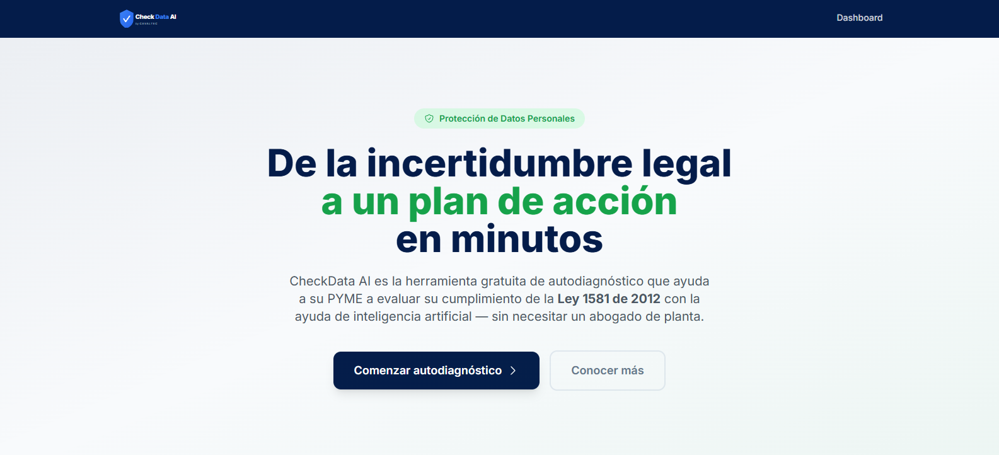
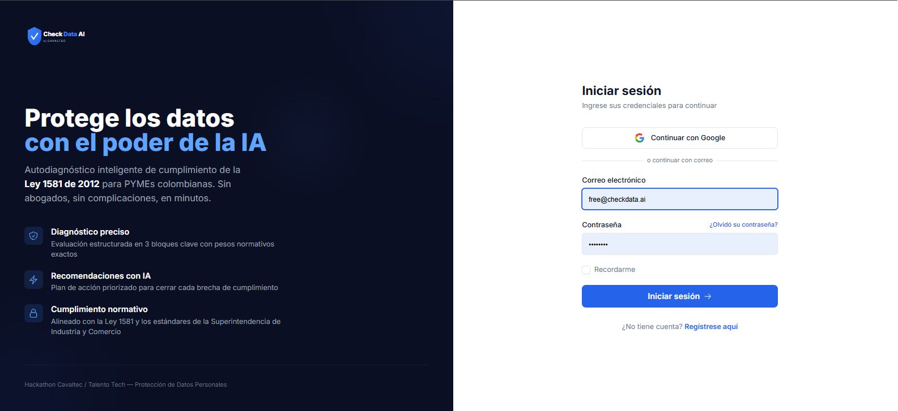
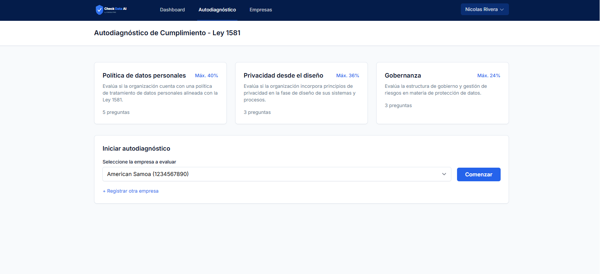
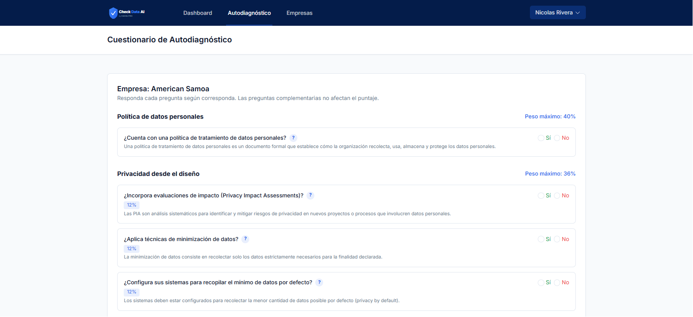
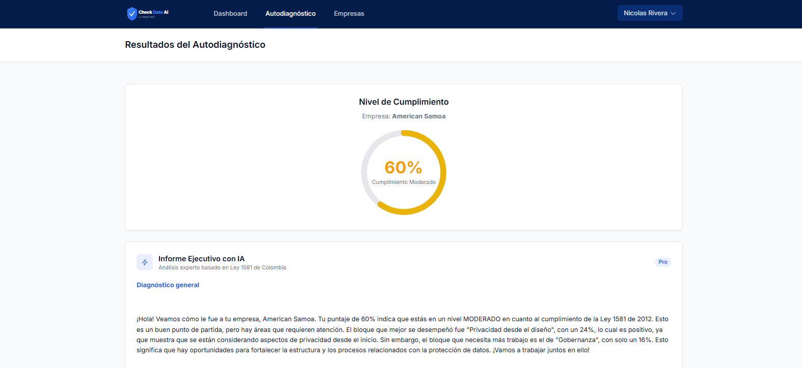
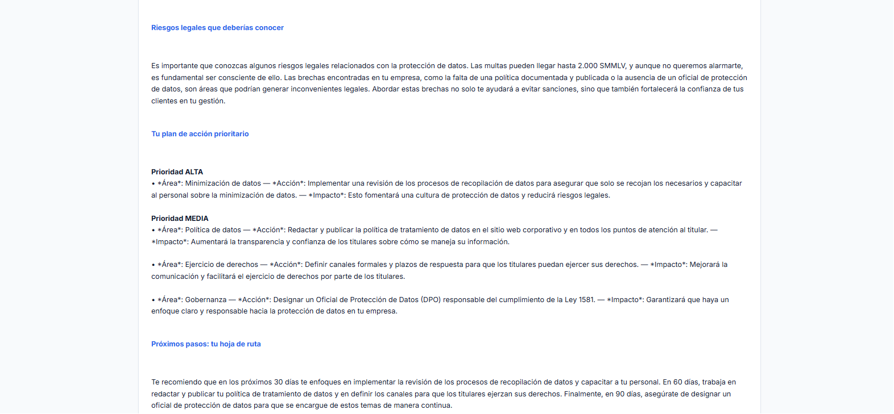
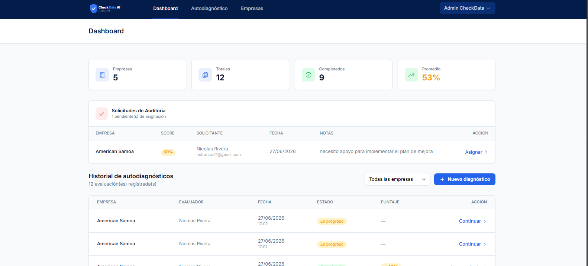
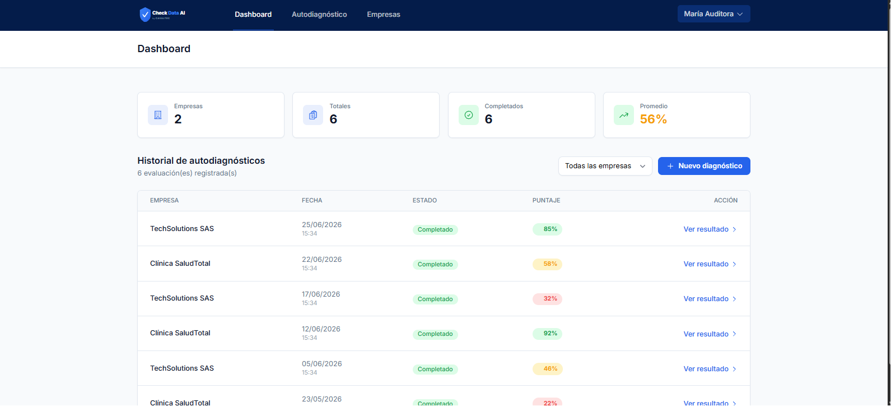

# CheckData AI — Autodiagnóstico de Cumplimiento Ley 1581

> *"De la incertidumbre legal a un plan de acción priorizado, en minutos — sin necesitar un abogado de planta."*

**Hackathon CAVALTEC / Talento Tech · Reto: Protección de Datos Personales**

---

## Índice

- [El reto empresarial](#el-reto-empresarial)
- [Cómo lo resolvemos](#cómo-lo-resolvemos)
- [Arquitectura](#arquitectura)
- [Tecnologías](#tecnologías)
- [Funcionalidades](#funcionalidades)
- [Roles y permisos](#roles-y-permisos)
- [Capturas de pantalla](#capturas-de-pantalla)
- [Video de la solución](#video-de-la-solución)
- [Repositorio y recursos](#repositorio-y-recursos)
- [Instalación local](#instalación-local)
- [Lo que nos diferencia](#lo-que-nos-diferencia)

---

## El reto empresarial

La **Ley 1581 de 2012** es de obligatorio cumplimiento en Colombia para toda persona natural o jurídica que trate datos personales. La Superintendencia de Industria y Comercio (SIC) sanciona su incumplimiento con multas de hasta **2.000 SMMLV**. El problema: hoy solo existen dos opciones para una PYME — contratar una consultoría costosa, o no hacer nada.

**CheckData AI** es la tercera opción: autodiagnóstico guiado por inteligencia artificial, en minutos, sin conocimientos legales previos.

---

## Cómo lo resolvemos

CheckData AI permite a cualquier empresa colombiana:

1. **Registrarse y autenticarse** de forma segura (email o Google OAuth).
2. **Registrar su empresa** con datos básicos (nombre, NIT, sector, tamaño).
3. **Responder un cuestionario estructurado** de 11 preguntas agrupadas en 3 bloques normativos, con ayuda de IA que traduce cada pregunta a lenguaje simple.
4. **Obtener su nivel de cumplimiento** (0–100%) calculado con pesos normativos exactos, junto con identificación de brechas por bloque.
5. **Recibir un plan de acción priorizado** generado por IA, con acciones de alta, media y baja prioridad para cerrar cada brecha.
6. **Descargar o recibir por correo** un informe ejecutivo profesional en PDF.
7. **Solicitar auditoría externa**, conectando la empresa con un auditor certificado que puede revisar sus evaluaciones históricas.

### Motor de scoring

El cuestionario cubre exactamente los 3 bloques definidos por la normativa:

| Bloque | Preguntas | Peso máximo |
|--------|-----------|-------------|
| Política de datos personales | 5 (Q1–Q5) | 40% |
| Privacidad desde el diseño | 3 (Q6–Q8) | 36% |
| Gobernanza | 3 (Q9–Q11) | 24% |

El cálculo se realiza **100% en el backend**, nunca en el navegador, garantizando integridad del resultado. Q1 y Q11 son preguntas de contexto y no suman al puntaje total.

---

## Arquitectura

```
┌─────────────────────────────────────────────────────┐
│                 USUARIO (Navegador)                  │
└─────────────────────────┬───────────────────────────┘
                          │ HTTPS
┌─────────────────────────▼───────────────────────────┐
│         FRONTEND — Blade + Alpine.js + Tailwind      │
│         Server-side rendering · Sin SPA              │
└─────────────────────────┬───────────────────────────┘
                          │ HTTP (mismo servidor)
┌─────────────────────────▼───────────────────────────┐
│         BACKEND — Laravel 11 · PHP 8.3               │
│  Breeze · Sanctum · Socialite · Policies · FormReq   │
│  ScoringService · AIService · PDFService             │
└────────────┬────────────────────────┬───────────────┘
             │ HTTPS (server-side)    │ SMTP
┌────────────▼──────────┐   ┌─────────▼──────────────┐
│  OpenAI GPT-4o-mini   │   │   Servidor de correo    │
│  (explicar preguntas, │   │   (informe PDF adjunto) │
│   recomendaciones,    │   └────────────────────────┘
│   informe ejecutivo)  │
└───────────────────────┘
```

### Decisiones de arquitectura clave

- **Un solo dominio / base de datos.** Multiempresa mediante `company_id` en cada tabla, sin subdominios ni schemas separados.
- **IA en el backend.** El API key de OpenAI nunca llega al navegador. Todos los llamados a IA pasan por controladores de Laravel.
- **Autorización mediante Policies.** Las reglas de acceso entre roles viven en `AssessmentPolicy`, no en el frontend.
- **Fallback de API key.** Si el key primario de OpenAI responde 401, el servicio reintenta automáticamente con el key de respaldo antes de fallar.
- **Seguridad OWASP.** Middleware de Security Headers, Form Requests en todos los endpoints de escritura, rate limiting en login, protección CSRF nativa de Laravel.

---

## Tecnologías

| Capa | Tecnología | Versión |
|------|-----------|---------|
| Lenguaje backend | PHP | 8.3 |
| Framework backend | Laravel | 11 |
| Autenticación | Laravel Breeze + Sanctum | v2 / v4 |
| OAuth social | Laravel Socialite (Google) | — |
| Frontend templating | Blade + Alpine.js | v3 |
| Estilos | Tailwind CSS | v3 |
| Build tool | Vite | — |
| Base de datos | SQLite / MySQL | — |
| IA generativa | OpenAI GPT-4o-mini | — |
| Exportación PDF | DomPDF (barryvdh/laravel-dompdf) | — |
| Envío de correos | Laravel Mail (SMTP) | — |
| Testing | PHPUnit | v11 |
| Linter PHP | Laravel Pint | v1 |
| Despliegue | Railway (Docker) | — |

---

## Funcionalidades

### Módulo de autenticación
- Registro e inicio de sesión por email y contraseña
- Login con Google (OAuth 2.0 via Laravel Socialite)
- Recuperación de contraseña por correo
- Verificación de email

### Módulo de empresa
- Registro de múltiples empresas por usuario (multiempresa)
- Datos: nombre, NIT, sector, tamaño
- Historial de diagnósticos por empresa

### Módulo de diagnóstico
- Cuestionario de 11 preguntas estructuradas en 3 bloques normativos
- Lógica condicional: sub-preguntas aparecen según respuesta al bloque padre
- Botón "?" junto a cada pregunta: llama a IA para obtener explicación en lenguaje simple
- Guardado automático del estado (borrador / completado)

### Módulo de resultados
- Indicador visual tipo gauge con nivel de cumplimiento (0–100%)
- Desglose por bloque normativo
- Identificación de brechas (preguntas respondidas negativamente)
- Recomendaciones concretas por brecha generadas con IA
- **Informe ejecutivo con IA:** análisis narrativo completo con diagnóstico general, riesgos legales y plan de acción en 30/60/90 días

### Módulo de reportes
- Exportación a PDF descargable
- Envío del informe por correo electrónico
- Informe de ejemplo: [`docs/diagnostico-american-samoa-10.pdf`](docs/diagnostico-american-samoa-10.pdf)

### Módulo de auditoría
- Solicitud de auditor externo desde la UI de la empresa evaluada
- Panel de administrador para asignar auditores a empresas
- El auditor accede en modo lectura al historial y resultados de sus empresas asignadas
- Notificaciones automáticas al auditor y a la empresa cuando se completa la asignación

### Dashboard
- Vista diferenciada por rol (Administrador / Evaluador / Auditor)
- Métricas globales: empresas, diagnósticos totales, completados, promedio de cumplimiento
- Historial de evaluaciones con filtro por empresa
- Acceso rápido a continuar diagnósticos en progreso

---

## Roles y permisos

| Rol | Puede hacer |
|-----|------------|
| **Administrador** | Ver y gestionar todas las empresas, todos los diagnósticos, asignar auditores, ver métricas globales |
| **Evaluador** | Crear y responder diagnósticos de sus propias empresas, ver su historial, solicitar auditor, descargar reportes |
| **Auditor** | Solo lectura de diagnósticos y reportes de las empresas que tenga asignadas |

La autorización real vive en `AssessmentPolicy` (backend). El frontend adapta la navegación al rol, pero no es la barrera de seguridad.

---

## Capturas de pantalla

### Landing


### Login — email + Google OAuth


### Inicio de diagnóstico — selección de empresa y bloques


### Cuestionario con asistencia IA por pregunta


### Resultados — gauge de cumplimiento e informe ejecutivo IA


### Plan de acción priorizado generado por IA


### Dashboard del Administrador


### Dashboard del Auditor


---

## Video de la solución

▶ [Ver video de demostración](https://drive.google.com/file/d/10JquiJ3QdNVBzF2IycLgFeZ2oOAM-zDy/view?usp=sharing)

El video muestra el flujo completo: Landing → Login → Registro de empresa → Cuestionario con ayuda de IA → Resultados con gauge → Informe ejecutivo → Descarga de PDF → Paneles por rol.

---

## Repositorio y recursos

| Recurso | Link |
|---------|------|
| Código fuente | [github.com/santiagofrancodev/hackathon-project](https://github.com/santiagofrancodev/hackathon-project) |
| Mockups / Prototipos | [github.com/santiagofrancodev/hackathon-project](https://github.com/santiagofrancodev/hackathon-project) |
| Video de la solución | [Google Drive](https://drive.google.com/file/d/10JquiJ3QdNVBzF2IycLgFeZ2oOAM-zDy/view?usp=sharing) |
| Ejemplo de informe PDF | [`docs/diagnostico-american-samoa-10.pdf`](docs/diagnostico-american-samoa-10.pdf) |

---

## Instalación local

### Requisitos

- PHP 8.3
- Composer
- Node.js 18+
- SQLite o MySQL

### Pasos

```bash
# 1. Clonar el repositorio
git clone https://github.com/santiagofrancodev/hackathon-project.git
cd hackathon-project

# 2. Instalar dependencias PHP
composer install

# 3. Instalar dependencias JS
npm install

# 4. Configurar entorno
cp .env.example .env
php artisan key:generate

# 5. Ejecutar migraciones y seeders
php artisan migrate --seed

# 6. Compilar assets
npm run build

# 7. Levantar servidor
php artisan serve
```

### Variables de entorno requeridas

```env
# Base de datos
DB_CONNECTION=sqlite

# Google OAuth (para login social)
GOOGLE_CLIENT_ID=
GOOGLE_CLIENT_SECRET=
GOOGLE_REDIRECT_URI=http://localhost:8000/auth/google/callback

# OpenAI (requerido para funcionalidades de IA)
OPENAI_API_KEY=sk-proj-...
OPENAI_API_KEY_FALLBACK=sk-proj-...   # se usa automáticamente si el primario falla
OPENAI_MODEL=gpt-4o-mini

# Correo electrónico (para envío de informes)
MAIL_MAILER=smtp
MAIL_HOST=
MAIL_PORT=587
MAIL_USERNAME=
MAIL_PASSWORD=
MAIL_FROM_ADDRESS=
```

---

## Lo que nos diferencia

| Diferenciador | Descripción |
|---------------|-------------|
| **IA contextual por pregunta** | Cada pregunta tiene un botón "?" que genera una explicación personalizada en lenguaje simple, sin jerga legal |
| **Informe ejecutivo narrativo** | No es una lista de recomendaciones genéricas — es un análisis redactado como consultor, con diagnóstico, riesgos legales y hoja de ruta en 30/60/90 días |
| **Rol Auditor multiempresa** | Flujo completo de solicitud y asignación de auditor externo, con notificaciones automáticas al auditor y a la empresa |
| **Fallback de IA resiliente** | Si el API key primario falla con 401, el sistema reintenta con el key de respaldo sin exponer el error al usuario |
| **Seguridad OWASP real** | Security Headers middleware, Form Requests en todos los endpoints de escritura, Policies de Laravel para autorización cross-empresa, CSRF nativo |
| **PDF + Email** | El informe no solo se muestra en pantalla — se descarga como PDF profesional y se puede enviar por correo directamente desde la plataforma |
| **Multiempresa nativa** | Un mismo usuario puede gestionar múltiples empresas y llevar histórico de diagnósticos independientes por cada una |

---

*Desarrollado en el Hackathon CAVALTEC / Talento Tech · Junio 2026*
